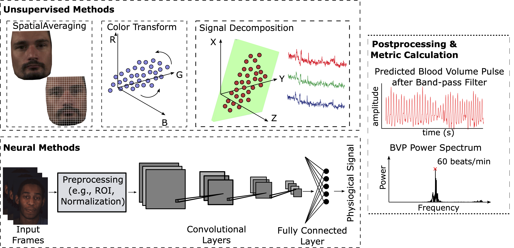
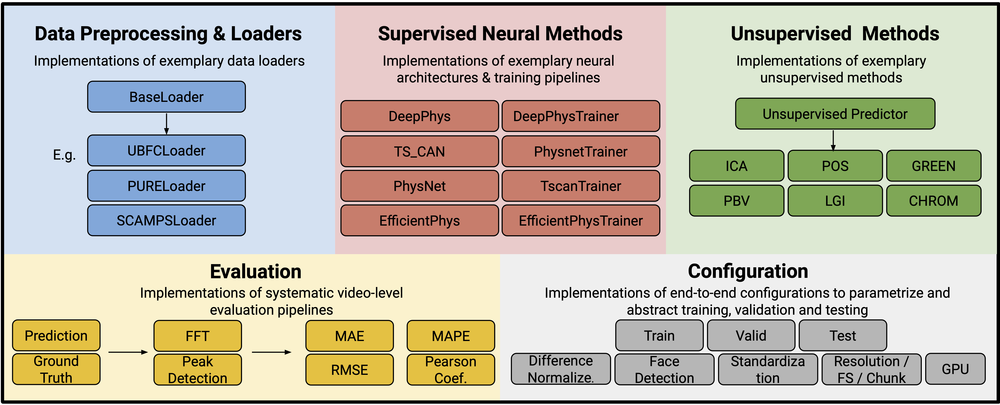
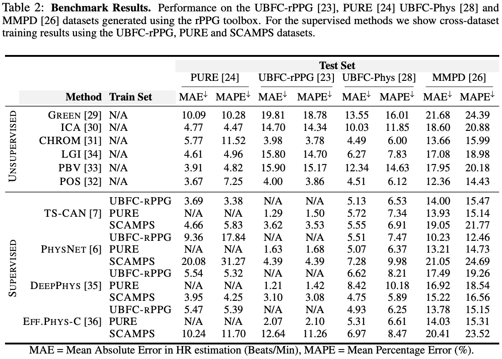
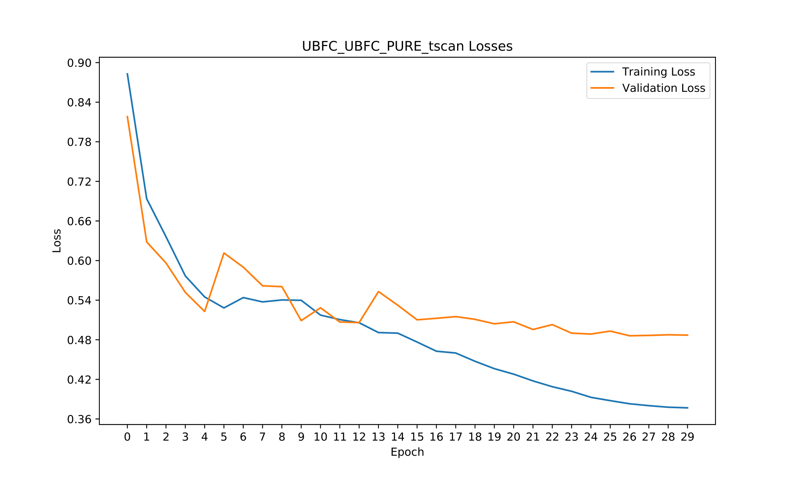
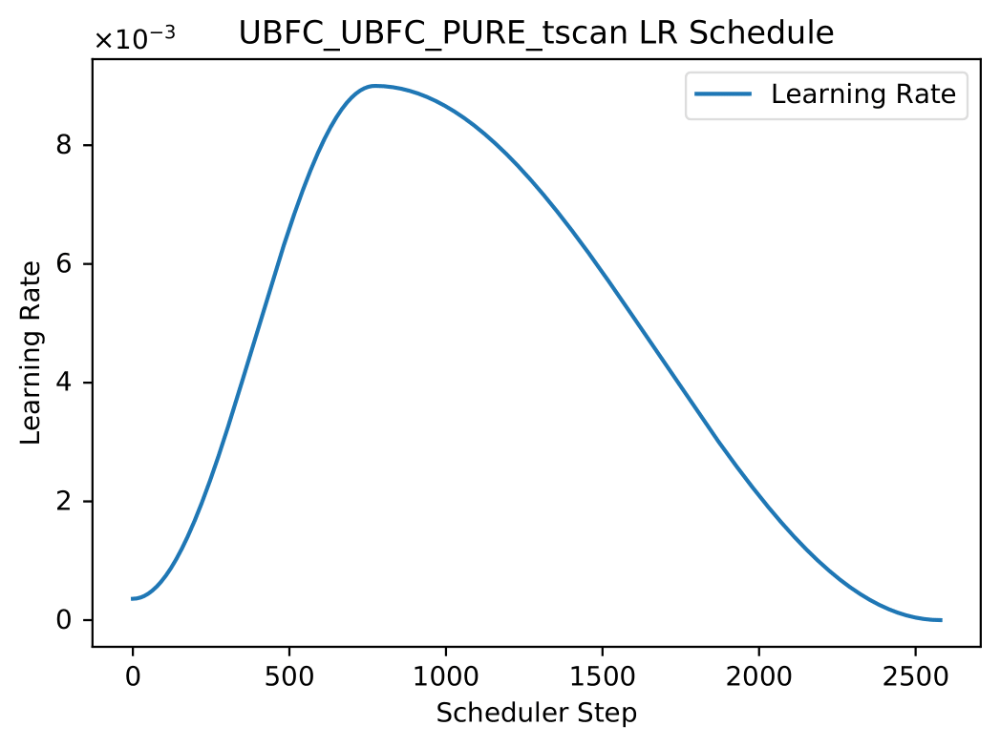
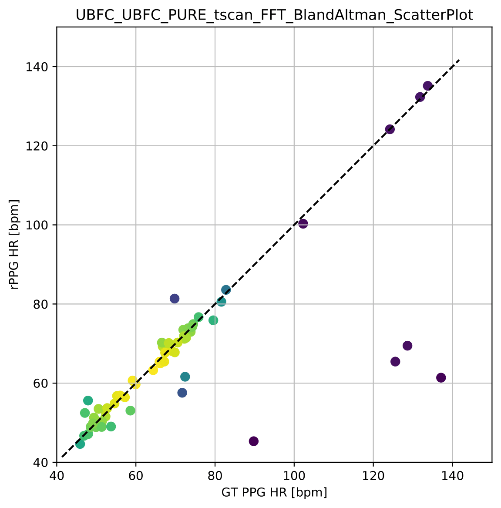
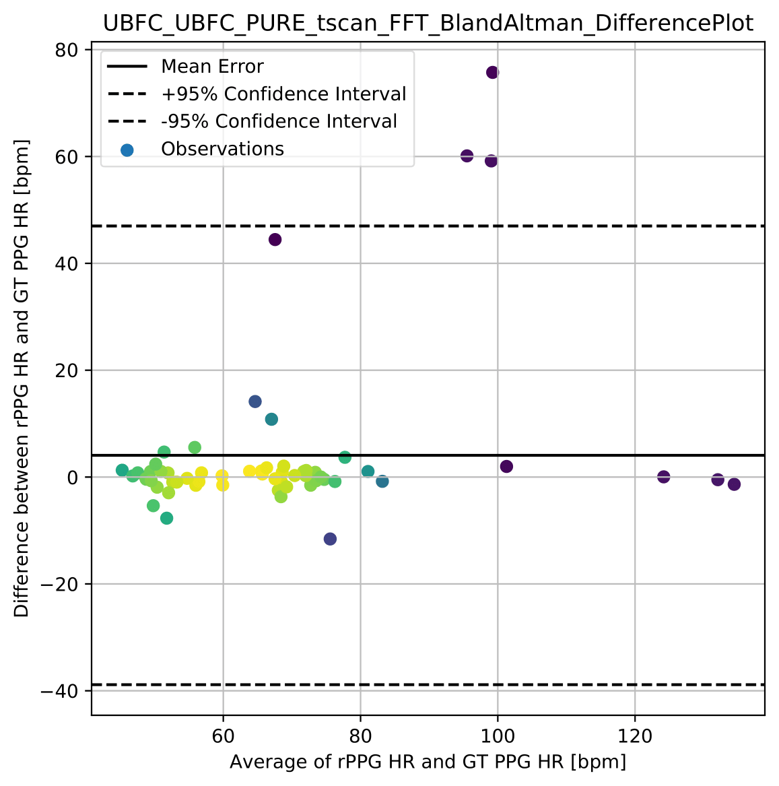
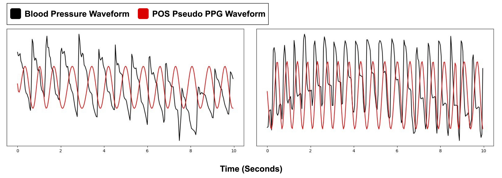

# Introduction

 <a href="https://github.com/ubicomplab/rPPG-Toolbox">rPPG-Toolbox</a> is an open-source platform designed for camera-based physiological sensing, also known as remote photoplethysmography (rPPG). This project forks rPPG-Toolbox and adds some functionalities:
 - We add a few face detectors and video stabilizers
 - We add support for the VitalVideos dataset and a few self made ones. For more details refer to the paper associated with this work
 - We add a few evaluation scripts, that are outlined in section Experiments
 - We add a few efficiency improvements
 - We add a demo application for android in the folder template-matching-android
 - We add the functionality to train neural networks with a ground truth for the heart rate

<!--  -->




rPPG-Toolbox not only benchmarks the **existing state-of-the-art neural and unsupervised methods**, but it also supports flexible and rapid development of your own algorithms.


# Quick start guide
- First setup the toolbox as described in section Setup
- Download the UBFC, VitalVideos and DeepStab dataset and place them in `/mnt/data/vitalVideos`, `/mnt/data/ubfc` and `/mnt/data/deepstab`
- Request the AdBannerVideos, DistributionShiftVideos and RealisticVideos datasets from the author of this work  and place them in `/mnt/data/dead_dataset`, `/mnt/data/ownVideos` and `/mnt/data/emergencyVideos`
- Then run `python deepstab_preprocess.py`, which will extract camera motion and store it as numpy tensors in `/mnt/results/deepstab/`
- Then run `python ppg_editor.py` and then label all PPG-peaks properly in both datasets, or request the edited_peaks.json files for both datasets from the author of this work and place them in `/mnt/data/vitalVideos/00_peaks.json`, `/mnt/data/ubfc/00_peaks.json`
- Then run `python config_generator.py`, which will generate about 700 YAML configuration files in configs/all_experiment_configs/
- Run `python prepare_experiment.py all`, which will copy all configuration files to configs/pipeline and rename them properly such that they are executed in the correct order
- Add your telegram API key and chat id in the `run_pipeline.py` script
- Run `python run_pipeline.py`, which will execute the experiments documented in the paper associated with this work. Warning: this might take a very long time
- Lastly run the evaluation scripts you need as explained in section Python Scripts to get the plots and tables needed

# Algorithms
rPPG-Toolbox currently supports the following algorithms: 

* Traditional Unsupervised Algorithms
  - [Remote plethysmographic imaging using ambient light (GREEN)](https://pdfs.semanticscholar.org/7cb4/46d61a72f76e774b696515c55c92c7aa32b6.pdf?_gl=1*1q7hzyz*_ga*NTEzMzk5OTY3LjE2ODYxMDg1MjE.*_ga_H7P4ZT52H5*MTY4NjEwODUyMC4xLjAuMTY4NjEwODUyMS41OS4wLjA), by Verkruysse *et al.*, 2008
  - [Advancements in noncontact multiparameter physiological measurements using a webcam (ICA)](https://affect.media.mit.edu/pdfs/11.Poh-etal-TBME.pdf), by Poh *et al.*, 2011
  - [Robust pulse rate from chrominance-based rppg (CHROM)](https://ieeexplore.ieee.org/document/6523142), by Haan *et al.*, 2013
  - [Local group invariance for heart rate estimation from face videos in the wild (LGI)](https://openaccess.thecvf.com/content_cvpr_2018_workshops/papers/w27/Pilz_Local_Group_Invariance_CVPR_2018_paper.pdf), by Pilz *et al.*, 2018
  - [Improved motion robustness of remote-PPG by using the blood volume pulse signature (PBV)](https://iopscience.iop.org/article/10.1088/0967-3334/35/9/1913), by Haan *et al.*, 2014
  - [Algorithmic principles of remote ppg (POS)](https://ieeexplore.ieee.org/document/7565547), by Wang *et al.*, 2016
  - [Face2PPG: An Unsupervised Pipeline for Blood Volume Pulse Extraction From Faces (OMIT)](https://ieeexplore.ieee.org/document/10227326), by Álvarez *et al.*, 2023


* Supervised Neural Algorithms 
  - [DeepPhys: Video-Based Physiological Measurement Using Convolutional Attention Networks (DeepPhys)](https://openaccess.thecvf.com/content_ECCV_2018/papers/Weixuan_Chen_DeepPhys_Video-Based_Physiological_ECCV_2018_paper.pdf), by Chen *et al.*, 2018
  - [Remote Photoplethysmograph Signal Measurement from Facial Videos Using Spatio-Temporal Networks (PhysNet)](https://bmvc2019.org/wp-content/uploads/papers/0186-paper.pdf), by Yu *et al.*, 2019
  - [Multi-Task Temporal Shift Attention Networks for On-Device Contactless Vitals Measurement (TS-CAN)](https://papers.nips.cc/paper/2020/file/e1228be46de6a0234ac22ded31417bc7-Paper.pdf), by Liu *et al.*, 2020
  - [EfficientPhys: Enabling Simple, Fast and Accurate Camera-Based Cardiac Measurement (EfficientPhys)](https://openaccess.thecvf.com/content/WACV2023/papers/Liu_EfficientPhys_Enabling_Simple_Fast_and_Accurate_Camera-Based_Cardiac_Measurement_WACV_2023_paper.pdf), by Liu *et al.*, 2023
  - [BigSmall: Efficient Multi-Task Learning for Disparate Spatial and Temporal Physiological Measurements
 (BigSmall)](https://arxiv.org/abs/2303.11573), by Narayanswamy *et al.*, 2023
  - [PhysFormer: Facial Video-based Physiological Measurement with Temporal Difference Transformer (PhysFormer)](https://openaccess.thecvf.com/content/CVPR2022/papers/Yu_PhysFormer_Facial_Video-Based_Physiological_Measurement_With_Temporal_Difference_Transformer_CVPR_2022_paper.pdf), by Yu *et al.*, 2022
  - [iBVPNet: 3D-CNN architecture introduced in iBVP dataset paper](https://doi.org/10.3390/electronics13071334), by Joshi *et al.*, 2024
  <!-- - [PhysMamba: Efficient Remote Physiological Measurement with SlowFast Temporal Difference Mamba](https://doi.org/10.48550/arXiv.2409.12031), by Luo *et al.*, 2024 -->
  - [RhythmFormer: Extracting rPPG Signals Based on Hierarchical Temporal Periodic Transformer](https://doi.org/10.48550/arXiv.2402.12788), by Zou *et al.*, 2024
  <!-- - [FactorizePhys: Matrix Factorization for Multidimensional Attention in Remote Physiological Sensing](https://proceedings.neurips.cc/paper_files/paper/2024/hash/af1c61e4dd59596f033d826419870602-Abstract-Conference.html), by Joshi *et al.*, 2024 -->

* Algorithms added by the author of this repoistory
  - PhysNetLifeness, A modified version of PhysNet, which outputs a binary prediction on whether the person is dead or not
  - PhysNetUncertainty, A modified version of PhysNet, which outputs a prediction of gaussian uncertainty together with the rPPG signal
  - PhysNetQuantile, A modified version of PhysNet, which outputs a prediction of lower and upper interval for the rPPG signal
  - HRClassifierUncertainty, A network developed to predict the heart rate and its gaussian uncertainty from a rPPG signal
  - HRClassifierUncertainty, A network developed to predict a lower and upper bound for the heart rate from a rPPG signal

# Datasets
The toolbox supports seven datasets, namely SCAMPS, UBFC-rPPG, PURE, BP4D+, UBFC-Phys, MMPD and iBVP. Please cite the corresponding papers when using these datasets. For now, we recommend training with UBFC-rPPG, PURE, iBVP or SCAMPS due to the level of synchronization and volume of the datasets. **To use these datasets in a deep learning model, you should organize the files as follows.**
* [MMPD](https://github.com/McJackTang/MMPD_rPPG_dataset)
    * Jiankai Tang, Kequan Chen, Yuntao Wang, Yuanchun Shi, Shwetak Patel, Daniel McDuff, Xin Liu, "MMPD: Multi-Domain Mobile Video Physiology Dataset", IEEE EMBC, 2023
    -----------------
         data/MMPD/
         |   |-- subject1/
         |       |-- p1_0.mat
         |       |-- p1_1.mat
         |       |...
         |       |-- p1_19.mat
         |   |-- subject2/
         |       |-- p2_0.mat
         |       |-- p2_1.mat
         |       |...
         |...
         |   |-- subjectn/
         |       |-- pn_0.mat
         |       |-- pn_1.mat
         |       |...
    -----------------
    
* [SCAMPS](https://arxiv.org/abs/2206.04197)
    * D. McDuff, M. Wander, X. Liu, B. Hill, J. Hernandez, J. Lester, T. Baltrusaitis, "SCAMPS: Synthetics for Camera Measurement of Physiological Signals", NeurIPS, 2022
    -----------------
         data/SCAMPS/Train/
            |-- P00001.mat
            |-- P00002.mat
         |...
         data/SCAMPS/Val/
            |-- P00001.mat
            |-- P00002.mat
         |...
         data/SCAMPS/Test/
            |-- P00001.mat
            |-- P00002.mat
         |...
    -----------------

* [UBFC-rPPG](https://sites.google.com/view/ybenezeth/ubfcrppg)
    * S. Bobbia, R. Macwan, Y. Benezeth, A. Mansouri, J. Dubois, "Unsupervised skin tissue segmentation for remote photoplethysmography", Pattern Recognition Letters, 2017.
    -----------------
         data/UBFC-rPPG/
         |   |-- subject1/
         |       |-- vid.avi
         |       |-- ground_truth.txt
         |   |-- subject2/
         |       |-- vid.avi
         |       |-- ground_truth.txt
         |...
         |   |-- subjectn/
         |       |-- vid.avi
         |       |-- ground_truth.txt
    -----------------
   
* [PURE](https://www.tu-ilmenau.de/universitaet/fakultaeten/fakultaet-informatik-und-automatisierung/profil/institute-und-fachgebiete/institut-fuer-technische-informatik-und-ingenieurinformatik/fachgebiet-neuroinformatik-und-kognitive-robotik/data-sets-code/pulse-rate-detection-dataset-pure)
    * Stricker, R., Müller, S., Gross, H.-M.Non-contact "Video-based Pulse Rate Measurement on a Mobile Service Robot"
in: Proc. 23st IEEE Int. Symposium on Robot and Human Interactive Communication (Ro-Man 2014), Edinburgh, Scotland, UK, pp. 1056 - 1062, IEEE 2014
    -----------------
         data/PURE/
         |   |-- 01-01/
         |      |-- 01-01/
         |      |-- 01-01.json
         |   |-- 01-02/
         |      |-- 01-02/
         |      |-- 01-02.json
         |...
         |   |-- ii-jj/
         |      |-- ii-jj/
         |      |-- ii-jj.json
    -----------------
    
* [BP4D+](https://www.cs.binghamton.edu/~lijun/Research/3DFE/3DFE_Analysis.html)
    * Zhang, Z., Girard, J., Wu, Y., Zhang, X., Liu, P., Ciftci, U., Canavan, S., Reale, M., Horowitz, A., Yang, H., Cohn, J., Ji, Q., Yin, L. "Multimodal Spontaneous Emotion Corpus for Human Behavior Analysis", IEEE International Conference on Computer Vision and Pattern Recognition (CVPR) 2016.   
    -----------------
        RawData/
         |   |-- 2D+3D/
         |       |-- F001.zip/
         |       |-- F002.zip
         |       |...
         |   |-- 2DFeatures/
         |       |-- F001_T1.mat
         |       |-- F001_T2.mat
         |       |...
         |   |-- 3DFeatures/
         |       |-- F001_T1.mat
         |       |-- F001_T2.mat
         |       |...
         |   |-- AUCoding/
         |       |-- AU_INT/
         |            |-- AU06/
         |               |-- F001_T1_AU06.csv
         |               |...
         |           |...
         |       |-- AU_OCC/
         |           |-- F00_T1.csv 
         |           |...
         |   |-- IRFeatures/
         |       |-- F001_T1.txt
         |       |...
         |   |-- Physiology/
         |       |-- F001/
         |           |-- T1/
         |               |-- BP_mmHg.txt
         |               |-- microsiemens.txt
         |               |--LA Mean BP_mmHg.txt
         |               |--LA Systolic BP_mmHg.txt
         |               |-- BP Dia_mmHg.txt
         |               |-- Pulse Rate_BPM.txt
         |               |-- Resp_Volts.txt
         |               |-- Respiration Rate_BPM.txt
         |       |...
         |   |-- Thermal/
         |       |-- F001/
         |           |-- T1.mv
         |           |...
         |       |...
         |   |-- BP4D+UserGuide_v0.2.pdf
    -----------------

* [UBFC-Phys](https://sites.google.com/view/ybenezeth/ubfc-phys)
    * Sabour, R. M., Benezeth, Y., De Oliveira, P., Chappe, J., & Yang, F. (2021). Ubfc-phys: A multimodal database for psychophysiological studies of social stress. IEEE Transactions on Affective Computing.  
    -----------------
          RawData/
          |   |-- s1/
          |       |-- vid_s1_T1.avi
          |       |-- vid_s1_T2.avi
          |       |...
          |       |-- bvp_s1_T1.csv
          |       |-- bvp_s1_T2.csv
          |   |-- s2/
          |       |-- vid_s2_T1.avi
          |       |-- vid_s2_T2.avi
          |       |...
          |       |-- bvp_s2_T1.csv
          |       |-- bvp_s2_T2.csv
          |...
          |   |-- sn/
          |       |-- vid_sn_T1.avi
          |       |-- vid_sn_T2.avi
          |       |...
          |       |-- bvp_sn_T1.csv
          |       |-- bvp_sn_T2.csv
    -----------------

* [iBVP](https://github.com/PhysiologicAILab/iBVP-Dataset)
    * Joshi, J.; Cho, Y. iBVP Dataset: RGB-Thermal rPPG Dataset with High Resolution Signal Quality Labels. Electronics 2024, 13, 1334.
    -----------------
          iBVP_Dataset/
          |   |-- p01_a/
          |      |-- p01_a_rgb/
          |      |-- p01_a_t/
          |      |-- p01_a_bvp.csv
          |   |-- p01_b/
          |      |-- p01_b_rgb/
          |      |-- p01_b_t/
          |      |-- p01_b_bvp.csv
          |...
          |   |-- pii_x/
          |      |-- pii_x_rgb/
          |      |-- pii_x_t/
          |      |-- pii_x_bvp.csv
    -----------------

* [VitalVideos](https://vitalvideos.org/)
    * Pieter-Jan Toye VitalVideos-Europe: A dataset of face videos with PPG and blood pressure ground truths

    -----------------
          vitalVideos/
          |   |-- 005e7070c2c3466aab7bac185e7fbd29_1.mp4
          |   |-- 005e7070c2c3466aab7bac185e7fbd29_2.mp4
          |...
          |   |-- 005e7070c2c3466aab7bac185e7fbd29.json
          |   |-- 01d1d2f99bba437aa9442c0a52d59d1e_1.mp4
          |   |-- 01d1d2f99bba437aa9442c0a52d59d1e_2.mp4
          |...
          |   |-- 01d1d2f99bba437aa9442c0a52d59d1e.json
          |...
    -----------------

## Benchmarks

The table shows  Mean Absolute Error (MAE) and Mean Absolute Percent Error (MAPE) performance across all the algorithms and datasets:



# Setup

You can use either [`conda`](https://docs.conda.io/projects/conda/en/latest/user-guide/install/index.html) or [`uv`](https://docs.astral.sh/uv/getting-started/installation/) with this toolbox. Most users are already familiar with `conda`, but `uv` may be a bit less familiar - check out some highlights about `uv` [here](https://docs.astral.sh/uv/#highlights). If you use `uv`, it's highly recommended you do so independently of `conda`, meaning you should make sure you're not installing anything in the base `conda` environment or any other `conda` environment. If you're having trouble making sure you're not in your base `conda` environment, try setting `conda config --set auto_activate_base false`.

STEP 1: `git clone --recurse-submodules https://github.com/flmoll/rPPG-Extractor`

STEP 2: `cd rPPG-Extractor` 

STEP 2: `docker compose up -d` 

STEP 3: `docker exec -it rppg-extractor-python-dev-container-1 /bin/bash` 

STEP 4: `cd src` 

STEP 5: `bash setup.sh uv` 

STEP 6: `source .venv/bin/activate`

If you use Windows or other operating systems, consider using [Windows Subsystem for Linux](https://learn.microsoft.com/en-us/windows/wsl/install) and following the steps within `setup.sh` independently.

# Example of Using Pre-trained Models 

Please use config files under `./configs/infer_configs`

For example, if you want to run The model trained on PURE and tested on UBFC-rPPG, use `python main.py --config_file ./configs/infer_configs/PURE_UBFC-rPPG_TSCAN_BASIC.yaml`

If you want to test unsupervised signal processing  methods, you can use `python main.py --config_file ./configs/infer_configs/UBFC-rPPG_UNSUPERVISED.yaml`

# Examples of Neural Network Training

Please use config files under `./configs/train_configs`

## Training on PURE and Testing on UBFC-rPPG With TSCAN 

STEP 1: Download the PURE raw data by asking the [paper authors](https://www.tu-ilmenau.de/universitaet/fakultaeten/fakultaet-informatik-und-automatisierung/profil/institute-und-fachgebiete/institut-fuer-technische-informatik-und-ingenieurinformatik/fachgebiet-neuroinformatik-und-kognitive-robotik/data-sets-code/pulse-rate-detection-dataset-pure).

STEP 2: Download the UBFC-rPPG raw data via [link](https://sites.google.com/view/ybenezeth/ubfcrppg)

STEP 3: Modify `./configs/train_configs/PURE_PURE_UBFC-rPPG_TSCAN_BASIC.yaml` 

STEP 4: Run `python main.py --config_file ./configs/train_configs/PURE_PURE_UBFC-rPPG_TSCAN_BASIC.yaml` 

Note 1: Preprocessing requires only once; thus turn it off on the yaml file when you train the network after the first time. 

Note 2: The example yaml setting will allow 80% of PURE to train and 20% of PURE to valid. 
After training, it will use the best model(with the least validation loss) to test on UBFC-rPPG.

## Training on SCAMPS and testing on UBFC-rPPG With DeepPhys

STEP 1: Download the SCAMPS via this [link](https://github.com/danmcduff/scampsdataset) and split it into train/val/test folders.

STEP 2: Download the UBFC-rPPG via [link](https://sites.google.com/view/ybenezeth/ubfcrppg)

STEP 3: Modify `./configs/train_configs/SCAMPS_SCAMPS_UBFC-rPPG_DEEPPHYS_BASIC.yaml` 

STEP 4: Run `python main.py --config_file ./configs/train_configs/SCAMPS_SCAMPS_UBFC-rPPG_DEEPPHYS_BASIC.yaml`

Note 1: Preprocessing requires only once; thus turn it off on the yaml file when you train the network after the first time. 

Note 2: The example yaml setting will allow 80% of SCAMPS to train and 20% of SCAMPS to valid. 
After training, it will use the best model(with the least validation loss) to test on UBFC-rPPG.

# Inference With Unsupervised Methods 

STEP 1: Download the UBFC-rPPG via [link](https://sites.google.com/view/ybenezeth/ubfcrppg)

STEP 2: Modify `./configs/infer_configs/UBFC_UNSUPERVISED.yaml` 

STEP 3: Run `python main.py --config_file ./configs/infer_configs/UBFC_UNSUPERVISED.yaml`

# Visualization of Preprocessed Data
A python notebook for visualizing preprocessed data can be found in `tools/preprocessing_viz` along with an associated README. The notebook, `viz_preprocessed_data.ipynb`, automatically detects the preprocessed data format and then plots input image examples and waveforms. 


# Plots of Training Losses and LR

This toolbox saves plots of training, and if applicable, validation losses automatically. Plots are saved in `LOG.PATH` (`runs/exp` by default). An example of these plots when training and validating with the UBFC-rPPG dataset and testing on the PURE dataset are shown below.




# Bland-Altman Plots

By default, this toolbox produces Bland-Altman plots as a part of its metrics evaluation process for both supervised and unsupervised methods. These plots are saved in the `LOG.PATH` (`runs/exp` by default). An example of these plots after training and validating with the UBFC-rPPG dataset and testing on the PURE dataset are shown below.

 

# Visualization of Neural Method Predictions

A python notebook for visualizing test-set neural method output predictions and labels can be found in `tools/output_signal_viz` along with an associated README. The notebook, `data_out_viz.ipynb`, given a `.pickle` output file, generated by setting `TEST.OUTPUT_SAVE_DIR` assists in plotting predicted PPG signals against ground-truth PPG signals.


# YAML File Setting
The rPPG-Toolbox uses yaml file to control all parameters for training and evaluation. 
You can modify the existing yaml files to meet your own training and testing requirements.

Here are some explanation of parameters:
* #### TOOLBOX_MODE: 
  * `train_and_test`: train on the dataset and use the newly trained model to test.
  * `only_test`: you need to set INFERENCE-MODEL_PATH, and it will use pre-trained model initialized with the MODEL_PATH to test.
* #### TRAIN / VALID / TEST / UNSUPERVISED DATA:
  * `PLOT_LOSSES_AND_LR`: If `True`, save plots of the training loss and validation loss, as well as the learning rate, to `LOG.PATH` (`runs/exp` by default). Currently, only a basic training loss and validation loss are plotted, but in the future additional losses utilized in certain trainer files (e.g., PhysFormer and BigSmall) will also be captured.
  * `USE_EXCLUSION_LIST`: If `True`, utilize a provided list to exclude preprocessed videos
  * `SELECT_TASKS`: If `True`, explicitly select tasks to load 
  * `DATA_PATH`: The input path of raw data
  * `CACHED_PATH`: The output path to preprocessed data. This path also houses a directory of .csv files containing data paths to files loaded by the dataloader. This filelist (found in default at CACHED_PATH/DataFileLists). These can be viewed for users to understand which files are used in each data split (train/val/test)
  * `EXP_DATA_NAME` If it is "", the toolbox generates a EXP_DATA_NAME based on other defined parameters. Otherwise, it uses the user-defined EXP_DATA_NAME.  
  * `BEGIN" & "END`: The portion of the dataset used for training/validation/testing. For example, if the `DATASET` is PURE, `BEGIN` is 0.0 and `END` is 0.8 under the TRAIN, the first 80% PURE is used for training the network. If the `DATASET` is PURE, `BEGIN` is 0.8 and `END` is 1.0 under the VALID, the last 20% PURE is used as the validation set. It is worth noting that validation and training sets don't have overlapping subjects.  
  * `VIDEO_SUBSET_TO_USE`: An array with two values, which are interpreted as the start time and the end time in the video to use for preprocessing. This parameter is in particular used for the emergency dataset.
  * `DATA_TYPE`: How to preprocess the video data
  * `CONVERT_TO_TYPE`: This parameter can be used for optimization. Set `DATA_TYPE` to ['DiffNormalized','Standardized'], which means both formats are preprocessed and later set `CONVERT_TO_TYPE` to the format needed e.g. `Standardized`. In that way the preprocessing needs to be done only one time and not twice.
  * `DATA_AUG`: If present, the type of generative data augmentation applied to video data
  * `LABEL_TYPE`: How to preprocess the label data
  *  `USE_PSUEDO_PPG_LABEL`: If `True` use POS generated PPG psuedo labels instead of dataset ground truth heart singal waveform
  * `DO_CHUNK`: Whether to split the raw data into smaller chunks
  * `CHUNK_LENGTH`: The length of each chunk (number of frames)
  * `DO_CROP_FACE`: Whether to perform face detection
  * `BACKEND`: Select which backend to use for face detection. Currently, the options are HC (Haar Cascade) or RF (RetinaFace). We recommend using Haar Cascade (the config default) in order to reproduce results from the [NeurIPS 2023 Datasets and Benchmarks paper](https://arxiv.org/abs/2210.00716) that corresponds to this toolbox. If you use RetinaFace, we recommend that you experiment with parameters such as `LARGE_BOX_COEF` and `USE_MEDIAN_BOX` depending on what dataset you are preprocessnig. We plan to update this README with optimal settings to use with RetinaFace in the near future.
  * `DYNAMIC_DETECTION`: If `False`, face detection is only performed at the first frame and the detected box is used to crop the video for all of the subsequent frames. If `True`, face detection is performed at a specific frequency which is defined by `DYNAMIC_DETECTION_FREQUENCY`. 
  * `DYNAMIC_DETECTION_FREQUENCY`: The frequency of face detection (number of frames) if DYNAMIC_DETECTION is `True`
  * `USE_MEDIAN_FACE_BOX`: If `True` and `DYNAMIC_DETECTION` is `True`, use the detected face boxs throughout each video to create a single, median face box per video.
  * `LARGE_FACE_BOX`: Whether to enlarge the rectangle of the detected face region in case the detected box is not large enough for some special cases (e.g., motion videos)
  * `LARGE_BOX_COEF`: The coefficient to scale the face box if `LARGE_FACE_BOX` is `True`.
  * `INFO`: This is a collection of parameters based on attributes of a dataset, such as gender, motion types, and skin color, that help select videos for inclusion in training, validation, or testing. Currently, only the [MMPD](https://github.com/McJackTang/MMPD_rPPG_dataset) dataset is supported for parameter-based video inclusion. Please refer to one of the config files involving the [MMPD](https://github.com/McJackTang/MMPD_rPPG_dataset) dataset for an example of using these parameters.
  * `EXCLUSION_LIST`: A list that specifies videos to exclude, typically based on a unique identifier to a video such as the combination of a subject ID and a task ID. This is only used if `USE_EXCLUSION_LIST` is set to `True`. Currently this parameter is only tested with the [UBFC-Phys](https://sites.google.com/view/ybenezeth/ubfc-phys) dataset. Please refer to one of the config files involving the [UBFC-Phys](https://sites.google.com/view/ybenezeth/ubfc-phys) dataset for an example of using this parameter.
  * `TASK_LIST`: A list to specify tasks to include when loading a dataset, allowing for selective inclusion of a subset of tasks or a single task in a dataset if desired. This is only used if `SELECT_TASKS` is set to `True`. Currently this parameter is only tested with the [UBFC-Phys](https://sites.google.com/view/ybenezeth/ubfc-phys) dataset. Please refer to one of the config files involving the [UBFC-Phys](https://sites.google.com/view/ybenezeth/ubfc-phys) dataset for an example of using this parameter.
  * `ARTIFICIAL_DESTABILISATION_BACKEND`: This parameter decides, which method is beeing used to augment the videos before preprocessing. Can be `None` for the default case, `DEEPSTAB` (video frames are shifted in x and y direction according to a camera path extracted from the DeepStab dataset), `GAUSSIAN_NOISE` (video frames are shifted in x and y direction by a random ammount), `RANDOM_AFFINE` (video frames are shifted in x and y direction and sheered by a random ammount), `H_264` (compressing and decompressing with H.264), `H_264_QP` (compressing and decompressing with H.264 with constant quantization parameter) or the same thing for H.265 (`H_265`, `H_265_QP`)
  * `ARTIFICIAL_DESTABILISATION_AMPLITUDE`: when `DEEPSTAB` is used, this parameter controls the amplitude of the shifts in x and y direction. When using one of the compression algorithms, it will be interpreted as the CRF value
  * `DEEPSTAB_PREPROCESSED_PATH`: The datapath where the DeepStab dataset is located. Ignored if `ARTIFICIAL_DESTABILISATION_BACKEND` != `DEEPSTAB`
  
* #### MODEL : Set used model (Deepphys, TSCAN, Physnet, EfficientPhys, BigSmall, and PhysFormer and their paramaters are supported).
* #### UNSUPERVISED METHOD: Set used unsupervised method. Example: ["ICA", "POS", "CHROM", "GREEN", "LGI", "PBV"]
* #### METRICS: Set used metrics. Example: ['MAE','RMSE','MAPE','Pearson','SNR','BA']
  * 'BA' metric corresponds to the generation of a Bland-Altman plot to graphically compare two measurement techniques (e.g., differences between measured and ground truth heart rates versus mean of measured and ground truth heart rates). This metric saves the plot in the `LOG.PATH` (`runs/exp` by default).
* #### INFERENCE:
  * `USE_SMALLER_WINDOW`: If `True`, use an evaluation window smaller than the video length for evaluation.

# Experiments
The study uses 9 different experiments where each experiment consists of multiple configuration files. The outputs for each experiment are stored in a separate folder named by the experiment in the `runs` directory. To run an experiment, use the prepare_experiment.py and run_pipeline.py commands. (e.g. to run deadalive execute the following commands: `python prepare_experiment.py deadalive` and `python run_pipeline.py`)A detailed description of each experiment is given below:

1. **compression**  
   In this experiment the PhysNet model is trained on compressed videos with CRF values ranging from 0 to 50 and various codecs. Afterwards, the models are tested on CRF values from 0 to 50.

2. **dataAug**  
   This experiment trains PhysNet models with different data augmentation strategies. The models are then executed on all available datasets.

3. **deadalive**  
   All models are first trained on the input data they require and then tested on all available datasets, including shuffled validation/test sets and the MOSSE-stabilized RealisticVideos dataset.

4. **deepstab**  
   Models are trained first on standard inputs with different stabilization backends and then on destabilized frames.

5. **emergency**  
   Executes models pretrained on VitalVideos and UBFC on the RealisticVideos dataset.

6. **facedetection**  
   Models are trained with different face detectors and then tested and validated.

7. **lifeness**  
   Trains the lifeness version of the PhysNet and tests on all available datasets, including shuffled validation and test sets.

8. **physnet_in_size**  
   Trains, tests, and validates PhysNet with different input sizes ranging from 20 to 100.

9. **uncertainty**  
   Evaluates the data likelihood and quantile regression version of PhysNet, trains a heart rate classifier on the outputs with different postprocessing methods, and executes everything on the test and validation sets.

---

# Python Scripts

All Python scripts meant to be executed directly from the command line are stored in the root folder. Each script is briefly described below:

- **compare_facedetectors.py**  
  Outputs a performance comparison of the three face detectors used in this study. Requires the `facedetection` experiment to be run.

- **compare_physnet_sizes.py**  
  Compares PhysNet performance with different input sizes. Requires the `physnet_in_size` experiment.

- **compare_skin_colors.py**  
  Compares PhysNet performance on different Fitzpatrick skin types. Requires the `deadalive` experiment.

- **compare_stabilizers.py**  
  Compares PhysNet performance with different stabilizers. Requires the `deepstab` experiment.

- **comparison_emergency.py**  
  Compares PhysNet performance on the RealisticVideos dataset. Requires the `emergency` experiment.

- **compression_evaluation.py**  
  Compares PhysNet performance on compressed videos. Requires the `compression` experiment.

- **compression_video_size_evaluation.py**  
  Applies H.264/H.265 compression with CRF values from 0–50 and compares video size reduction.

- **config_generator.py**  
  Generates config files for all experiments, performs sanity checks, and outputs them to `configs/all_experiment_configs`.

- **conformalization_evaluation.py**  
  Calibrates uncertainty outputs on the validation set and plots coverage for each method.

- **construct_uncertainty_tables.py**  
  Outputs tables comparing uncertainty outputs on all datasets.

- **dataset_statistics.py**  
  Outputs plots for relevant statistics of the VitalVideos dataset.

- **deepstab_preprocess.py**  
  Processes Deepstab dataset, extracts pixel shifts, and exports `.npy` files. This script should be run before executing the deepstab experiment

- **http_client.py**  
  Test HTTP client to send a single data sample to the server. Before executing update the path to a preprocessed datasample and update server IP and port.

- **http_server.py**  
  Demo server application designed to match the demo Android app. Before executing update the pretrained model weight paths, server IP and port.

- **hyperparameter_search_hrfilter.py**  
  Determines optimal parameters for postprocessing and heart rate extraction using Bayesian estimation.

- **lifeness_evaluation.py**  
  Produces a table of lifeness outputs from PhysNet.

- **main.py**  
  Adapted from rPPG-Toolbox; executes training/testing of models using a YAML configuration file.

- **main_PyEVM.py**  
  Executes color, motion, or phase-based motion magnification algorithms. It needs the module PyEVM, which is not included in the public repository due to licence restrictions.

- **main_export_model.py**  
  Exports a model to a format readable by the demo Android application.

- **ppg_editor.py**  
  Used for peak labeling in ground truth datasets.

- **prepare_experiment.py**  
  Copies configuration files of a selected experiment into `configs/pipeline`.

- **run_pipeline.py**  
  Executes all YAML files in `configs/pipeline`, moves success/failure outputs, and logs execution. It can also send the user a telegram message in case something goes wrong. Add API key and chat id before executing the script

- **run_pipeline_check.py**  
  Performs sanity checks on YAML files to detect issues such as missing pretrained models.

- **setup.sh**  
  Sets up the Python environment using UV package manager.

---

# Folder Structure

- **config_generation**  
  Scripts for generating configuration files. Automatically executed by `config_generator.py`.

- **configs**  
  Contains example and auto-generated YAML configuration files.

- **csv**  
  Stores exported data in Excel format.

- **dataset**  
  Logic for reading and processing datasets. Add new datasets here.

- **dataset_recorder**  
  Independent module with its own README and requirements; records datasets with ground truth.

- **evaluation**  
  Utility methods for evaluation after AI processing.

- **figures**  
  Example figures from the original rPPG-Toolbox.

- **final_model_release**  
  Example network weights from the original rPPG-Toolbox.

- **graphics**  
  Figures generated in this work.

- **mosse**  
  MOSSE stabilizer code.

- **neural_methods**  
  Neural network algorithm definitions.

- **opencv_zoo**  
  Contains a [github repository](https://github.com/opencv/opencv_zoo/tree/main) that hosts a lot of different models, that can be used together with opencv. 

- **PyEVM**  
  Module for color, motion, or phase-based magnification algorithms. Based on [phase_based](https://github.com/itberrios/phase_based/tree/main) and [PyEVM](https://github.com/kingdh/pyevm/tree/master). Due to licence restrictions, this module is not included in the public repository.

- **rppg_buffers**  
  Stores postprocessed PPG signals used for heart rate network training.

- **runs**  
  Stores experiment outputs: plots, model outputs, and weights.

- **template-matching-android**  
  This folder contains the demo application for android. It has its own README.md file.

- **tools**  
  Jupyter notebooks for data visualization and processing.

- **unsupervised_methods**  
  Non-AI algorithms for PPG signal extraction.

- **wip**  
  Dataset comparisons from rPPG-Toolbox.

# Config generation
- Since this study uses a lot of configuration files and it is very easy to make mistakes when creating new files, a script is used to automatically generate them
- The generation process for each experiment from section Experiments is split into a separate file in folder config_generation
- A few modifiable parameters are given at the beginning of every script (e.g. models to compare, face detectors, stabilizers). The behaviour of each experiment can be changed slightly with those parameters. For the changes to take effect, rerun `config_generator.py`

# Executing a motion magnification algorithm
* The motion magnification algorithms were not used in the evaluations done in this work, but they were included in the code in case someone finds it useful.
* The algorithms can be executed with the script main_PyEVM.py
* The given video will be processed in batches with an overlap between consecutive batches. In the overlap regions, the output is reconstructed with a fading between the outputs of the first and the second batch to ensure a smooth transition.

## Motion Magnification – Configuration Parameters

The algorithm can be configured with the following parameters:

| Parameter                 | Type       | Default       | Description |
|---------------------------|------------|---------------|-------------|
| `file_name`               | `str`      | `""`          | Path to the input video file. |
| `output_folder`           | `str`      | `""`          | Directory where the results will be stored. |
| `suffix`                  | `str`      | `"out"`       | Suffix appended to the output file name. |
| `overlay_with_orig_vid`   | `bool`     | `True`        | Overlay the magnified signal on the original video. |
| `save_filtered_tensor`    | `bool`     | `True`        | Save intermediate filtered tensors. |
| `save_mask`               | `bool`     | `True`        | Save the spatial mask used during processing. |
| `mode`                    | `Mode`     | `COLOR`       | Processing mode (e.g. `COLOR`). |
| `vitallens_method`        | `VitalLensMethod` | `G` | Method for VitalLens signal extraction. |
| `max_frame`               | `int`      | `1000`        | Maximum number of frames to process. |
| `frame_offset`            | `int`      | `0`           | Number of frames to skip at the start. |
| `samples_per_batch`       | `int`      | `100`         | Number of frames processed in each batch. |
| `processing_windows_overlap` | `int`  | `20`          | Overlap (in frames) between consecutive batches. |
| `color_space`             | `Colorspace` | `RGB`       | Color space (`RGB`, `YCbCr`, etc.). |
| `filter_type`             | `FilterType` | `IDEAL`     | Temporal filter type (`IDEAL`, `BUTTERWORTH`, etc.). |
| `filter_order`            | `int`      | `3`           | Order of the temporal filter. |
| `low`                     | `float`    | `0.8`         | Low cutoff frequency (Hz). |
| `high`                    | `float`    | `1.2`         | High cutoff frequency (Hz). |
| `levels`                  | `int`      | `3`           | Number of pyramid decomposition levels. |
| `orientations`            | `int`      | `4`           | Number of filter orientations. |
| `sigma`                   | `int`      | `2`           | Standard deviation of the Gaussian kernel. |
| `lambda_cutoff`           | `float`    | `10`          | Wavelength cutoff for pyramid filtering. |
| `filters_per_octave`      | `int`      | `4`           | Number of filters per octave. |
| `transition_width`        | `float`    | `0.5`         | Transition width for frequency bands. |
| `amplification`           | `list`     | `[20,20,20]`  | Amplification factors per channel. |
---

### Notes
- The settings can be configured in main_PyEVM.py together with face detection and skin segmentation
- Increase `amplification` for stronger motion magnification (too high may add noise).  
- Adjust `low` and `high` to match the physiological frequency of interest (e.g. heart rate ~1 Hz).  
- Reduce `levels` for faster processing, increase for finer detail.  
    
# Adding a New Dataset

* STEP 1: Create a new python file in `dataset/data_loader`, e.g. MyLoader.py

* STEP 2: Implement the required functions, including:

  ```python
  def preprocess_dataset(self, config_preprocess):
  ```
  ```python
  def read_peak_data(self, data_dirs, sampling_rate=30):
  ```
  ```python
  @staticmethod
  def read_video(video_file):
  ```
  ```python
  @staticmethod
  def read_wave(bvp_file):
  ```

* STEP 3:[Optional] Override optional functions. In principle, all functions in BaseLoader can be override, but we **do not** recommend you to override *\_\_len\_\_, \_\_get\_item\_\_,save,load*.
* STEP 4:Set or add configuration parameters.  To set paramteters, create new yaml files in configs/ .  Adding parameters requires modifying config.py, adding new parameters' definition and initial values.

# Adding a new face detector / stabilizer
* STEP 1: create a new class in `dataset/facedetection/facedetectors.py`. It should be a subclass of AbstractFaceDetector.

* STEP 2: implement the following methods:

  ```python
  def detect_faces(self, frame: np.ndarray): 
  ```
  
  ```python
  def get_last_bounding_box(self):
  ```

  A stabilizer can be implemented the same way

# Adding a New Neural Algorithm

* STEP 1: Define a model in a new python file in `neural_methods/model`, e.g. NewModel.py.

* STEP 2: Implement the corresponding training/testing routines in a file `neural_methods/trainer`, e.g. NewModelTrainer.py. Ensure to implement the following functions:

  ```python
  def __init__(self, config, data_loader):
  ```
  ```python
  def train(self, data_loader):
  ```
  ```python
  def valid(self, data_loader):
  ```

  ```python
  def test(self, data_loader)
  ```

  ```python
  def save_model(index)
  ```

* STEP 3: Add logic to `main.py` to use the models in the following `train_and_test` and `test` functions. 

* STEP 4: Create new yaml files in configs/ corresponding to the new algorithm.

# Adding a New Unsupervised Algorithms

* STEP 1: Define a algorithm in a new python file in `unsupervised_methods/methods`, e.g. NewMethod.py.

* STEP 2: Add logic to `main.py` to use the models in the following `unsupervised_method_inference` function. 

* STEP 3: Create new yaml files in configs/ corresponding to the new algorithm.

# Weakly Supervised Training 

Supervised rPPG training requires high fidelity synchronous PPG waveform labels. However not all datasets contain such high quality labels. In these cases we offer the option to train on synchronous PPG "pseudo" labels derived through a signal processing methodology. These labels are produced by using POS-generated PPG waveforms, which are then bandpass filtered around the normal heart-rate frequencies, and finally amplitude normalized using a Hilbert-signal envelope. The tight filtering and envelope normalization results in a strong periodic proxy signal, but at the cost of limited signal morphology.



# Motion Augmented Training

The usage of synthetic data in the training of machine learning models for medical applications is becoming a key tool that warrants further research. In addition to providing support for the fully synthetic dataset [SCAMPS](https://arxiv.org/abs/2206.04197), we provide provide support for synthetic, motion-augmented versions of the [UBFC-rPPG](https://sites.google.com/view/ybenezeth/ubfcrppg), [PURE](https://www.tu-ilmenau.de/universitaet/fakultaeten/fakultaet-informatik-und-automatisierung/profil/institute-und-fachgebiete/institut-fuer-technische-informatik-und-ingenieurinformatik/fachgebiet-neuroinformatik-und-kognitive-robotik/data-sets-code/pulse-rate-detection-dataset-pure), [SCAMPS](https://arxiv.org/abs/2206.04197), and [UBFC-Phys](https://sites.google.com/view/ybenezeth/ubfc-phys) datasets for further exploration toward the use of synthetic data for training rPPG models. The synthetic, motion-augmented datasets are generated using the [MA-rPPG Video Toolbox](https://github.com/Roni-Lab/MA-rPPG-Video-Toolbox), an open-source motion augmentation pipeline targeted for increasing motion diversity in rPPG videos. You can generate and utilize the aforementioned motion-augmented datasets using the steps below.

* STEP 1: Follow the instructions in the [README](https://github.com/Roni-Lab/MA-rPPG-Video-Toolbox/blob/main/README.md) of the [MA-rPPG Video Toolbox](https://github.com/Roni-Lab/MA-rPPG-Video-Toolbox) GitHub repo to generate any of the supported motion-augmented datasets. NOTE: You will have to have an original, unaugmented version of a dataset and driving video to generate a motion-augmented dataset. More information can be found [here](https://github.com/Roni-Lab/MA-rPPG-Video-Toolbox#file_folder-datasets). 

* STEP 2: Using any config file of your choice in this toolbox, modify the `DATA_AUG` parameter (set to `'None'` by default) to `'Motion'`. Currently, only `train_configs` that utilize the UBFC-rPPG or PURE datasets have this parameter visible, but you can also modify other config files to add the `DATA_AUG` parameter below the `DATA_TYPE` parameter that is visible in all config files. This will enable the proper funciton for loading motion-augmented data that is in the `.npy` format.

* STEP 3: Run the corresponding config file. Your saved model's filename will have `MA` appended to the corresponding data splits that are motion-augmented.

If you use the aforementioned functionality, please remember to cite the following in addition to citing the rPPG-Toolbox:
* Paruchuri, A., Liu, X., Pan, Y., Patel, S., McDuff, D., & Sengupta, S. (2023). Motion Matters: Neural Motion Transfer for Better Camera Physiological Sensing. arXiv preprint arXiv:2303.12059.

Refer to this [BibTeX](https://github.com/Roni-Lab/MA-rPPG-Video-Toolbox#scroll-citation) for quick inclusion into a `.bib` file.

<p align="center">
  
</p>

# Extending the Toolbox to Multi-Tasking With BigSmall

We implement [BigSmall](https://girishvn.github.io/BigSmall/) as an example to show how this toolbox may be extended to support physiological multitasking. If you use this functionality please cite the following publication: 
* Narayanswamy, G., Liu, Y., Yang, Y., Ma, C., Liu, X., McDuff, D., Patel, S. "BigSmall: Efficient Multi-Task Learning For Physiological Measurements" https://arxiv.org/abs/2303.11573

The BigSmall mode multi-tasks pulse (PPG regression), respiration (regression), and facial action (multilabel AU classification). The model is trained and evaluated (in this toolbox) on the AU label subset (described in the BigSmall publication) of the BP4D+ dataset, using a 3-fold cross validation method (using the same folds as in the BigSmall publication).

* STEP 1: Download the BP4D+ by emailing the authors found [here](https://www.cs.binghamton.edu/~lijun/Research/3DFE/3DFE_Analysis.html).

* STEP 2: Modify `./configs/train_configs/BP4D_BP4D_BIGSMALL_FOLD1.yaml` to train the first fold (config files also exist for the 2nd and 3rd fold).

* STEP 3: Run `python main.py --config_file ./configs/train_configs/BP4D_BP4D_BIGSMALL_FOLD1.yaml `

<p align="center">
  
</p>

# Citation
This is an adapted version of rPPG-Toolbox [paper](https://arxiv.org/abs/2210.00716).
If you find this work useful cite the original rPPG-Toolbox paper.

```
@article{liu2022rppg,
  title={rPPG-Toolbox: Deep Remote PPG Toolbox},
  author={Liu, Xin and Narayanswamy, Girish and Paruchuri, Akshay and Zhang, Xiaoyu and Tang, Jiankai and Zhang, Yuzhe and Wang, Yuntao and Sengupta, Soumyadip and Patel, Shwetak and McDuff, Daniel},
  journal={arXiv preprint arXiv:2210.00716},
  year={2022}
}
```

# License
- This repository has 5 repositories in it, where each of them has its own licence
- The main repository at the root folder and the one in dataset_recorder use the Responsibel AI licence
- The demo application under template-matching-android uses the GPL licence
- The mosse stabilizer under mosse uses the MIT licence
- opencv_zoo uses the Apache Licence

<a href="https://www.licenses.ai/source-code-license">
  Responsible AI
</a>

<a href="https://www.gnu.org/licenses/gpl-3.0.html">
  GPL
</a>

<a href="https://opensource.org/licenses/MIT">
  MIT
</a>

<a href="https://www.apache.org/licenses/LICENSE-2.0">
  Apache
</a>


# Acknowledgement 

The rPPG-Toolbox research project is supported by a Google PhD Fellowship for Xin Liu and a research grant from Cisco for the University of Washington as well as a career start-up funding grant from the Department of Computer Science at UNC Chapel Hill. This research is also supported by Tsinghua University Initiative Scientific Research Program, Beijing Natural Science Foundation,  and the Natural Science Foundation of China (NSFC). We also would like to acknowledge all the contributors from the open-source community. 

